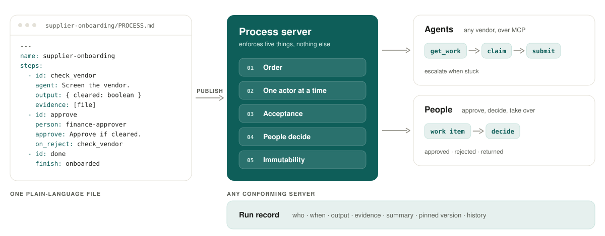

<div align="center">

<a href="https://agentprocess.io/docs/">
  <picture>
    <source media="(prefers-color-scheme: dark)" srcset=".github/assets/logo-dark.svg">
    
  </picture>
</a>

### The open protocol for business processes that AI agents and people work through together.

Write a process as one plain-language file. Any agent does the steps. People make the decisions.<br>A process server keeps the order, checks the work and keeps the record.

[](spec/specification.md)
[](LICENSE)
[](https://modelcontextprotocol.io)
[](skills/agentprocess/SKILL.md)
[](https://github.com/agentprocess/agentprocess/discussions)

[**Docs**](https://agentprocess.io/docs/) · [**Why Agent Process**](WHY.md) · [**Specification**](spec/specification.md) · [**Quickstart**](authoring/quickstart.md) · [**Discussions**](https://github.com/agentprocess/agentprocess/discussions)

</div>

<br>

<picture>
  <source media="(prefers-color-scheme: dark)" srcset=".github/assets/hero-dark.svg">
  
</picture>

## Why Agent Process

Agents can now do real steps of business work: screen a supplier, check an invoice, draft a contract summary. Organizations are adopting them fast and scaling them slowly. 88% of organizations use AI in at least one function, yet no more than 10% are scaling AI agents in any single function, and Gartner expects over 40% of agentic AI projects to be cancelled by the end of 2027. ([sources](WHY.md#sources))

The gap is not the model. It is everything around the steps:

- **Who goes next?** Work must pass between agents and people in order, with context.
- **Who must sign off?** Some decisions belong to people, provably, every time.
- **Is it what was asked for?** Output must be checked before anything moves.
- **What happened?** Every run needs a record that answers the auditor's question.

The agent stack already has open standards for **tools** ([MCP](https://modelcontextprotocol.io)) and **know-how** ([Agent Skills](https://agentskills.io)). Agent Process is the open standard for the **process**.

> [!TIP]
> **Read the full case:** [Why Agent Process](WHY.md) covers the evidence, how existing approaches compare, what the protocol solves today and what it deliberately does not, with eight exhibits and cited sources.

## How it works

**1. Write the process.** One `PROCESS.md`: a short YAML frontmatter and a body in plain language.

```markdown
---
name: supplier-onboarding
description: Check a new supplier against sanctions lists and get finance approval.
inputs:
  vendorName: string
requires:
  systems: [sanctions-screening]
steps:
  - id: check_vendor
    agent: Check the vendor against the OFAC and EU sanctions lists. Attach the report.
    output: { cleared: boolean }
    evidence: [file]
    next:
      - { to: approve, when: Vendor is cleared on both lists }
      - { to: decline, when: Any sanctions hit }
  - id: approve
    person: finance-approver
    approve: Approve only when the vendor is cleared and the spend is justified.
    on_reject: check_vendor
    next: done
  - id: decline
    finish: declined
  - id: done
    finish: onboarded
---

# Supplier onboarding

The agent screens the vendor, finance approves, and the supplier is onboarded.
```

**2. Publish it to a process server.** The server checks the file, maps `finance-approver` to a group of people, and publishes a numbered version with a content hash. That version never changes.

**3. Agents and people work it.** Any MCP-capable agent runs the same loop on any conforming server:

```text
get_work  → ready steps this agent may claim, oldest first
claim     → a lease, the step's instructions, the process body, the run so far
            … the agent does the work with its own tools …
submit    → output, evidence and a summary; refused with every issue if incomplete
escalate  → "I cannot finish this": the step goes to a person with a note
```

People get work items and `decide`: approve, reject with a note, return, complete, or fail.

**4. The server enforces five things, and nothing else.**

| | Guarantee | What it means |
|:-:|---|---|
| 1 | **Order** | Work exists only along the declared steps. |
| 2 | **One actor at a time** | A claimed step belongs to one agent until it submits, hands off, or its lease ends. |
| 3 | **Acceptance** | A submission completes a step only when it matches the declared fields and evidence. Otherwise nothing changes and every issue comes back at once. |
| 4 | **People decide** | Only a person completes an approval or a person's task. An agent never can. |
| 5 | **Immutability** | A published version never changes, and a run keeps its version for life. |

## Highlights

<table>
<tr>
<td width="50%" valign="top">

**Plain language, not a programming model**<br>
No decision tables, expressions or scripts. A process owner can read and change every line; the agent adapts to the instructions.

</td>
<td width="50%" valign="top">

**Exact where it matters**<br>
Fourteen MCP tools with fixed names, seven error codes and JSON Schemas for every argument and result. An agent can fill a gap in instructions, never in a contract.

</td>
</tr>
<tr>
<td valign="top">

**Rework and hand-offs built in**<br>
Rejections send the run back with the note. Every claim carries a `handoff` with what the last attempt left. Stuck agents escalate to a person.

</td>
<td valign="top">

**Trust earned, not assumed**<br>
Start with approvals. Add model checks in advisory mode, compare them with real decisions, and let them pre-screen or replace approvals only where policy allows.

</td>
</tr>
<tr>
<td valign="top">

**Safe to retry, safe to rehearse**<br>
Every write is idempotent on a `requestId`. Test runs rehearse a process end to end with no real effects.

</td>
<td valign="top">

**Small on purpose**<br>
Features arrive only as one-page profiles, and only when a real process cannot be written without them. Today there are two: `parallel` and `check`.

</td>
</tr>
</table>

## Get started

| You are | Start here | Then |
|---|---|---|
| **A process author** | [Quickstart](authoring/quickstart.md): write a process and follow a test run | [Best practices](authoring/best-practices.md) |
| **An agent builder** | [Add support to your agent](agents/adding-support.md): the loop, errors and retries | [Install the agent skill](agents/skill.md) |
| **A server implementer** | [Implementing a process server](servers/implementing.md) | [Conformance fixtures](conformance/README.md) |
| **Evaluating it** | [Why Agent Process](WHY.md) | [Specification](spec/specification.md) |

### Give your agent the skill

The [`agentprocess` skill](skills/agentprocess/SKILL.md) teaches any [Agent Skills](https://agentskills.io)-compatible agent to work steps and write processes:

```bash
git clone https://github.com/agentprocess/agentprocess.git
mkdir -p .agents/skills && cp -r agentprocess/skills/agentprocess .agents/skills/
```

## How it compares

| | Plain-language definition | Agents from any vendor | People decide, enforced | Output checked before moving on | Durable record | Open, portable |
|---|:-:|:-:|:-:|:-:|:-:|:-:|
| Workflow and BPM engines | ◐ | ◐ | ● | ◐ | ● | ◐ |
| Agent orchestration frameworks | ○ | ◐ | ◐ | ◐ | ◐ | ○ |
| Instructions alone (prompts, skills) | ● | ● | ○ | ○ | ○ | ● |
| **Agent Process** | **●** | **●** | **●** | **●** | **●** | **●** |

<sub>● designed for it · ◐ possible with configuration or code · ○ not addressed. Typical products in each category; individual products vary. Full comparison and reasoning in [Why Agent Process](WHY.md#4-existing-approaches-each-solve-part-of-the-problem).</sub>

## What's in this repository

| Path | What it is |
|---|---|
| [`WHY.md`](WHY.md) | The case for the protocol: problem, evidence, alternatives, limits. |
| [`spec/specification.md`](spec/specification.md) | The specification: format, running, tools, evidence, guarantees. |
| [`spec/tools.md`](spec/tools.md) | Exact arguments, results and errors of every tool. |
| [`spec/profiles/`](spec/profiles/) | Optional profiles: [`parallel`](spec/profiles/parallel.md) and [`check`](spec/profiles/check.md). |
| [`spec/revisions.md`](spec/revisions.md) | Every revision and what prompted it. |
| [`schemas/core-2/`](schemas/core-2/index.json) | JSON Schemas (draft 2020-12), also served at their `$id` URLs. |
| [`skills/agentprocess/`](skills/agentprocess/SKILL.md) | The agent skill. |
| [`authoring/`](authoring/quickstart.md), [`agents/`](agents/adding-support.md), [`servers/`](servers/implementing.md) | Guides for each audience. |
| [`conformance/`](conformance/README.md) | Twelve processes for testing a server. |
| [`research/`](research/README.md) | The three independent reviews that shaped the specification. |

Everything here is also published, rendered, at **[agentprocess.io/docs](https://agentprocess.io/docs/)**, with each page available as Markdown and all of it in one file at [`/llms-full.txt`](https://agentprocess.io/llms-full.txt).

## Status and roadmap

Agent Process is a **draft**, version `core-2`, revision 10. One server implements it today. It will be called a standard only when a second, independent implementation passes the conformance suite.

- [x] Specification, tool contracts and the `parallel` and `check` profiles
- [x] JSON Schemas for the document, shared shapes and every tool
- [x] Agent skill for any Agent Skills-compatible agent
- [x] Conformance fixtures from independent reviews
- [x] A reference server running the full protocol
- [ ] A second, independent implementation
- [ ] A portable conformance runner that tests any server over MCP
- [ ] An open reference library for parsing, validation and content hashing

## FAQ

<details>
<summary><b>Is Agent Process an agent or an agent framework?</b></summary>
<br>
Neither. It does no work itself and runs no code. Agents bring their own models, tools and permissions; Agent Process defines how they take steps of a process, what they hand back, and when a person decides.
</details>

<details>
<summary><b>How does it relate to MCP?</b></summary>
<br>
MCP is the transport. Agents connect to a process server as an MCP server and call fourteen tools with fixed contracts. Agent Process defines what those tools mean and what the server guarantees.
</details>

<details>
<summary><b>How does it relate to Agent Skills?</b></summary>
<br>
A skill gives an agent know-how for a task; a process decides which task is next, who does it, and what counts as done. They work together: an agent can use any skill inside a step, and the <code>agentprocess</code> skill teaches an agent the protocol itself.
</details>

<details>
<summary><b>Why not a workflow engine or BPMN?</b></summary>
<br>
Workflow engines model everything, so definitions become software only specialists can change. Agent Process keeps the format small and lets plain-language instructions and the model carry the scenario, while the server enforces the five guarantees exactly.
</details>

<details>
<summary><b>Does it require a particular model or vendor?</b></summary>
<br>
No. Any agent that can call MCP tools can work steps, and any conforming server can run any process. The optional <code>check</code> profile names no model or provider.
</details>

<details>
<summary><b>Does it make us compliant?</b></summary>
<br>
No. It gives you enforced human decisions, pinned versions and a durable record, which is where oversight and logging naturally live. Authority, segregation of duties and regulatory conformity remain your organization's responsibility.
</details>

## Community and contributing

- **Questions and proposals:** [GitHub Discussions](https://github.com/agentprocess/agentprocess/discussions). Proposals start from a real process the core cannot express.
- **Bugs in the specification:** [open an issue](https://github.com/agentprocess/agentprocess/issues/new/choose): contradictions, ambiguities, schema mismatches, broken examples.
- **Building an implementation?** Tell us in Discussions. Implementations that pass conformance are listed.

Read [CONTRIBUTING.md](CONTRIBUTING.md) before opening a pull request. The bar for adding to the specification is high: *when in doubt, leave it out.* This project follows a [code of conduct](CODE_OF_CONDUCT.md).

## License

[Apache-2.0](LICENSE). The specification, schemas, skill, guides and fixtures are free to use, implement and build on.
