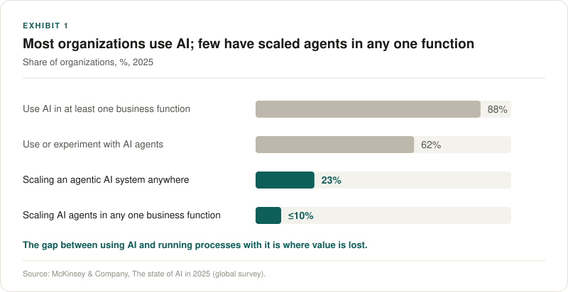
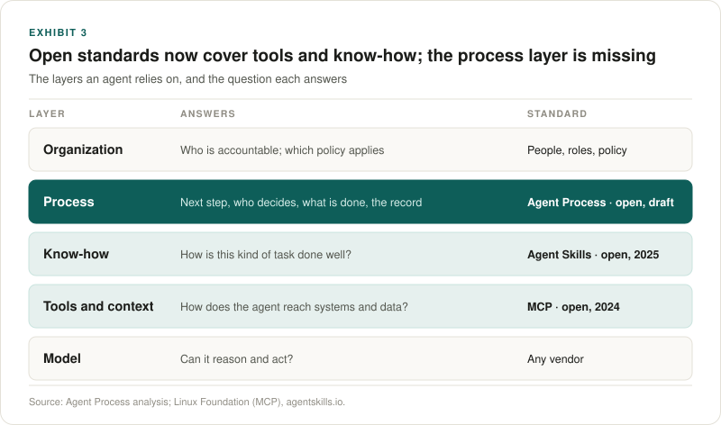
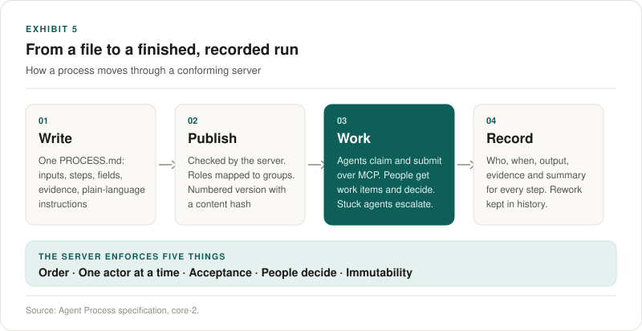
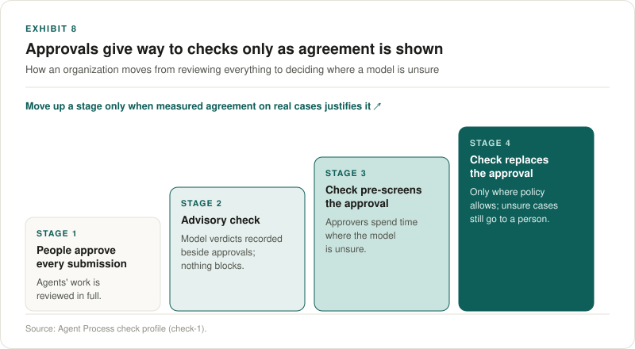

October 2026 · Agent Process · Draft `core-2`

> **Key takeaways**
>
> 1. **Adoption is broad; scale is rare.** 88% of organizations use AI somewhere, but no more than 10% are scaling AI agents in any single business function, and Gartner expects over 40% of agentic AI projects to be cancelled by the end of 2027.
> 2. **The bottleneck is the process around the work, not the model doing it.** Organizations that get value redesign their workflows. What a capable agent lacks is order, hand-offs to people, a check that the output is what was asked for, and a record.
> 3. **The layers below are standardized; the process layer is not.** MCP connects agents to tools and Agent Skills gives them know-how. Nothing open says which step comes next, when a person must decide, what counts as done, and what is kept.
> 4. **Agent Process is that layer, and deliberately small.** One plain-language file per process, a server that enforces five guarantees, and agents from any vendor connecting over MCP.
> 5. **It works today, as a draft.** The specification, schemas, agent skill and conformance fixtures are open. One server implements it. The next milestone is a second, independent implementation.

## 1. Agent adoption is broad, but little of it reaches the processes that run a business

Almost every organization now uses AI somewhere. McKinsey's 2025 global survey found 88% of organizations using AI in at least one business function, up from 78% a year earlier, and 62% using or experimenting with AI agents. Only 23% are scaling an agentic system anywhere in the enterprise, and in any single business function no more than 10% are. [1]

The projects that do start are fragile. Gartner predicts that over 40% of agentic AI projects will be cancelled by the end of 2027, citing escalating costs, unclear business value and inadequate risk controls. [2] MIT's NANDA initiative, drawing on interviews, a survey and an analysis of 300 public deployments, found that about 95% of enterprise generative AI pilots stall without measurable return, and placed the cause not in model quality but in how the tools are integrated into the work. [3]

The pattern is consistent: the models are good enough to do the steps. The organizations are not yet able to trust them with the process.

## 2. The bottleneck is the process around the work, not the model doing it

McKinsey's high performers, the roughly 6% of organizations that attribute 5% or more of EBIT to AI, are nearly three times as likely as others to have fundamentally redesigned their workflows, and workflow redesign is among the strongest contributors to impact of all the factors the survey tested. [1] Value comes from changing how work flows, not from adding a capable assistant to an unchanged one.

A business process asks for five things that a capable agent does not supply on its own.

**Exhibit 2. What a business process needs, and what an agent alone provides**

| A process needs | An agent alone | Without it |
|---|---|---|
| **Order.** The next step, and only the next step, is ready. | Does what it is asked, in the order it chooses. | Steps are skipped, repeated or done out of turn. |
| **Hand-offs.** Work passes to the right person or agent, with context. | Holds context only within its own session. | People chase status in chat and email. |
| **Acceptance.** Output is checked against what the step asked for before anything moves. | Reports success in its own words. | Gaps are found at approval, or by the customer. |
| **People decide.** Approvals and judgement calls are made by people, provably. | Can be asked to approve, and will. | No reliable line between suggestion and decision. |
| **A record.** Who did what, when, with what evidence, against which version. | Leaves a transcript, if anything. | Audit questions are answered by reconstruction. |

*Source: Agent Process analysis.*

Regulation points the same way. For high-risk systems, the EU AI Act requires that people can effectively oversee the system while it is in use (Article 14) and that events are recorded automatically over its lifetime (Article 12). [4][5] A process layer does not make anyone compliant, but it is where oversight and records naturally live.

## 3. The layers below are standardized; the process layer is not

In under two years the agent stack has acquired open standards. The Model Context Protocol, introduced in November 2024, gives agents a common way to reach tools and data. OpenAI, Google DeepMind and Microsoft adopted it during 2025, and in December 2025 it was donated to the Agentic AI Foundation under the Linux Foundation. [6] Agent Skills, released as an open standard the same month, gives agents a common way to load procedural know-how, and more than 40 agent products now list support. [7][8]

Neither standard was designed to answer process questions: which step is ready, who may claim it, what output completes it, when a person must decide, what happens on rejection, and what is kept. Today each team answers them again in its own code, prompts or tools, and the answers do not travel. A process written for one agent product or one orchestration framework cannot run on another.

## 4. Existing approaches each solve part of the problem

Organizations already have tools for parts of this. None was built for work shared between people and agents from different vendors.

**Exhibit 4. How existing approaches cover what an agent-and-people process needs**

| | Written in plain language | Agents from any vendor | People decide, enforced | Output checked before moving on | Durable record | Open, portable definition |
|---|:-:|:-:|:-:|:-:|:-:|:-:|
| Workflow and BPM engines | ◐ | ◐ | ● | ◐ | ● | ◐ |
| Robotic process automation | ○ | ○ | ◐ | ○ | ◐ | ○ |
| Agent orchestration frameworks | ○ | ◐ | ◐ | ◐ | ◐ | ○ |
| Instructions alone (prompts, skills) | ● | ● | ○ | ○ | ○ | ● |
| Ticketing and approval tools | ◐ | ○ | ● | ○ | ● | ○ |
| **Agent Process** | **●** | **●** | **●** | **●** | **●** | **●** |

*● Designed for it ◐ Possible with configuration or code ○ Not addressed. Assessment of typical products in each category; individual products vary. Agent Process is a draft with one implementation.*

Workflow engines are the closest fit, and the lesson from them is instructive: they model everything, so their definitions become software that only specialists can change. Instructions alone sit at the other extreme: anyone can write them and any agent can read them, but nothing enforces them. Agent Process takes a position between the two.

## 5. Agent Process makes the process the unit: one file, five guarantees, any agent

A process is one `PROCESS.md` file: a short YAML frontmatter that names the process, the inputs a run starts with and its steps, and a body in plain language. Each step has one kind: an agent's work, a person's task, an approval, a wait, or a finish. A step declares the fields it must return and the evidence it must attach. Everything specific to a scenario stays in plain-language instructions that the agent or person adapts to.

A process server runs it and enforces exactly five things:

1. **Order.** Work exists only along the declared steps.
2. **One actor at a time.** A claimed step belongs to one agent until it submits, hands off, or its lease ends.
3. **Acceptance.** A submission completes a step only when it matches the declared fields and evidence; otherwise nothing changes and every issue comes back at once.
4. **People decide.** Only a person completes an approval or a person's task. An agent never can.
5. **Immutability.** A published version never changes, and a run keeps its version for life.

Three design choices follow from the evidence above.

- **The format carries as little as possible.** The rule is borrowed from Agent Skills: instructions and the model carry the rest. There are no decision tables, scripting languages or expression syntax. A process owner can read and change every line.
- **The wire carries everything exactly.** An agent can fill a gap in instructions; it cannot fill a gap in a tool contract. Fourteen MCP tools have fixed names, arguments, results and seven error codes, published as JSON Schemas.
- **Features arrive only on demonstrated need.** Before any server existed, three independent reviews wrote ten real processes against the draft. Eight fit the core, one needed a workaround and one needed parallel work, which became the only structural profile. [9]

## 6. What it solves today

The difference shows most clearly at the moments where processes usually break. Take supplier onboarding: an agent screens a new vendor against sanctions lists, finance approves, the supplier is set up.

**Exhibit 6. The moments where processes break, with and without a process layer**

| Moment | Agent with no process layer | With Agent Process |
|---|---|---|
| The screening is done. Who works next? | Someone notices the agent's message and forwards it. | The approval becomes ready and a work item appears for the finance group. |
| The agent's report is missing a list. | Found by the approver, or not at all. | The submission is refused with every missing field listed; nothing moves. |
| Finance rejects with a note. | A new conversation; earlier work is lost or redone. | The run returns to screening with the finance note in its data; the earlier attempt is kept in history. |
| The agent cannot finish. | It guesses, or stops silently. | It escalates with a note. A person returns, completes or fails the step. |
| The process changes mid-quarter. | Running work follows whichever instructions are current. | Running work keeps its version; new runs use the new one. |
| An auditor asks who approved, on what evidence. | Reconstructed from chat, email and logs. | The run record holds the approver, time, note, file hashes and the version's content hash. |

*Source: Agent Process specification, revision 10.*

Each of these behaviours is specified, implemented in the reference server, and exercised by its test suite. A test mode lets an organization rehearse a process end to end without real effects before it goes live.

## 7. Each party gets something different

**Exhibit 7. What Agent Process offers each party**

| Party | What they get |
|---|---|
| **Business owners** | Processes that agents and people run together, with sign-off where it matters and a record of every run. Freedom to change agents without rewriting processes. |
| **Process authors** | One readable file per process. Change a sentence, not a program. Version history that cannot be rewritten. |
| **Agent builders** | One integration that works on any conforming server: find work, claim it, do it, submit it. Exact contracts and every error at once. |
| **Platform and server builders** | A small, precise specification with schemas and conformance fixtures, so competition is on the quality of the server rather than lock-in. |
| **Risk and audit** | Enforced human decisions, refusals before bad output moves, pinned versions and a durable record of evidence. |

## 8. Trust is earned step by step, not assumed

No organization should hand a process to agents on day one, and Agent Process does not ask it to. A process starts with people approving the agents' work. The optional `check` profile lets a model answer fixed questions about each submission. Run first in advisory mode, its verdicts are recorded beside the approvers' decisions, so an organization can measure agreement on real cases before letting a check pre-screen or, where policy allows, replace an approval.

People stay on every decision that policy requires. The protocol moves them from checking everything to deciding where a model is unsure.

## 9. What Agent Process is not

Being precise about limits is part of the design.

- **It is not an agent.** It does no work itself. Agents bring their own tools and permissions; a process grants none.
- **It is not a workflow engine that runs code.** The server keeps order and the record; it does not execute scripts or call systems on the process's behalf.
- **It does not prove business correctness.** Field and evidence rules prove that the output has the declared shape, not that it is right. People and checks judge that.
- **It does not establish authority or compliance.** Approval matrices, segregation of duties and regulatory conformity remain the organization's responsibility.
- **It is a draft.** One implementation exists. There are no adoption figures yet, and none are claimed here.

## 10. What happens next

A protocol becomes a standard when others can implement it without its authors. The work ahead is ordered accordingly:

1. **A second, independent implementation**, in another language, from the specification, schemas and fixtures alone.
2. **A portable conformance runner** that tests any server over MCP.
3. **An open reference library** for parsing, validation and content hashing.
4. **Real processes in real organizations**, run first with approvals and advisory checks, so every future change comes from use rather than theory.

Process authors can start with the [quickstart](authoring/quickstart.md). Agent builders can [add support](agents/adding-support.md) or install the [agent skill](agents/skill.md). Server builders can read [Implementing a process server](servers/implementing.md) and the [conformance fixtures](conformance/README.md). Proposals belong in GitHub Discussions, starting from a real process the core cannot express.

## Sources

1. McKinsey & Company, [*The state of AI in 2025: Agents, innovation, and transformation*](https://www.mckinsey.com/capabilities/quantumblack/our-insights/the-state-of-ai), 2025.
2. Gartner, [*Gartner Predicts Over 40% of Agentic AI Projects Will Be Canceled by End of 2027*](https://www.gartner.com/en/newsroom/press-releases/2025-06-25-gartner-predicts-over-40-percent-of-agentic-ai-projects-will-be-canceled-by-end-of-2027), press release, 25 June 2025.
3. MIT NANDA, *The GenAI Divide: State of AI in Business 2025*, as reported by [Fortune](https://fortune.com/2025/08/18/mit-report-95-percent-generative-ai-pilots-at-companies-failing-cfo/), 18 August 2025.
4. European Union, Regulation (EU) 2024/1689 (AI Act), [Article 14: Human oversight](https://ai-act-service-desk.ec.europa.eu/en/ai-act/article-14).
5. European Union, Regulation (EU) 2024/1689 (AI Act), [Article 12: Record-keeping](https://ai-act-service-desk.ec.europa.eu/en/ai-act/article-12).
6. [Model Context Protocol](https://en.wikipedia.org/wiki/Model_Context_Protocol), history and governance, including its donation to the Agentic AI Foundation, December 2025.
7. SiliconANGLE, [*Anthropic makes Agent Skills an open standard*](https://siliconangle.com/2025/12/18/anthropic-makes-agent-skills-open-standard/), 18 December 2025.
8. [agentskills.io client showcase](https://agentskills.io/clients), observed October 2026.
9. [Research: how the specification was tested](research/README.md).
