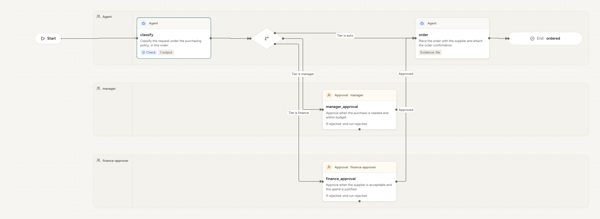

A process is a series of decisions: which way to go, whether work is acceptable, whether to approve. Agent Process has no hidden rules engine. **Every decision is made by someone accountable, in the open, and recorded with its reason**: the agent or person doing the step, a person who must decide, a model answering fixed questions, or the server applying objective rules.

## Four kinds of decision

| Decision | Who makes it | How it is expressed | What is recorded |
|---|---|---|---|
| **Which way to go** | The agent or person doing the step | `next` as a list of routes, each with a `when` label | The chosen route and a reason, in `steps.<id>.next` and `reason` |
| **Approve or reject** | A person in the step's role | An `approve:` step, with `on_reject` | `decision`, `note`, who and when, tied to the data they saw |
| **Is this work good enough?** | A model, through the `check` profile | Yes/no, choice or rubric questions on the step | Every question, answer, threshold result and the model, in `steps.<id>.check` |
| **Is it what was asked for?** | The server | `output` fields, types, `one_of`, `evidence` | A refusal listing every issue, handed to the next attempt |

People keep the final word. An agent can choose a route and a model can judge work, but only a person completes an approval, and a model that is unsure sends the step to a person.

## Route choices

When a step can end more than one way, it lists the routes and says when to take each. The actor chooses one and gives a reason, which the server records beside the output.

```yaml
next:
  - { to: approve, when: Vendor is cleared on both lists }
  - { to: decline, when: Any sanctions hit }
```

Write `when` labels that genuinely distinguish the outcomes, and say in the instructions what to do when none fits. The `when` text is not evaluated by the server. It guides the actor and labels the line on the [process map](process-maps.md).

## People's decisions

An `approve:` step is a decision only a person can make. The work item names what to approve, the person sees the whole run, and the decision carries a snapshot of the run data, so a decision made on stale information is refused rather than applied. A rejection carries a note, and `on_reject` sends the run back to the step that can fix it. A person's `task:` can also choose between routes, which is how a business choice that needs judgement and authority stays with people.

## Model decisions: the `check` profile

A `check` asks a model fixed questions about a submission after the objective rules pass. There are three kinds of question:

| Kind | The model answers | Passes when |
|---|---|---|
| **Yes/no** | A probability that the answer is yes | It is at or above `pass`. Below `fail`, it fails; between the two, it is unsure. |
| **Choice** | One of the named answers in `one_of`, with a confidence | The answer is in `pass`. Answers in `unsure`, or low confidence, are unsure. |
| **Rubric** | A level from an ordered list, worst first, with a confidence | The level is at or above `pass`. |

The step's verdict is the worst answer. A pass completes the step. A fail refuses the submission and tells the next attempt why. An unsure verdict sends the step to a person with the model's answers. With `advisory: true`, verdicts are recorded and never block, so an organization can compare them with people's decisions before trusting them. See the [`check` profile](../spec/profiles/check.md) for every key.

## Policy rules: decision tables, written as instructions

Many decisions are policy: a threshold, a tier, a list of conditions. In Agent Process a rule is written in the step's instructions, applied by the actor, captured in a typed output, and verified by a check. The result is a decision table that a process owner can read, that the agent follows, and that is enforced where it matters.

```markdown purchase-routing/PROCESS.md
---
name: purchase-routing
description: Route a purchase request to the right level of approval under the purchasing policy.
inputs:
  amount: { type: number, description: Total in USD }
  supplier: string
  onCatalog: boolean
steps:
  - id: classify
    agent: |
      Classify the request under the purchasing policy, in this order:
      1. A new supplier, or 10,000 USD or more: tier finance.
      2. Under 1,000 USD and on the catalog: tier auto.
      3. Anything else: tier manager.
      State the amount and the rule you applied in your summary.
    output:
      tier: { type: string, one_of: [auto, manager, finance] }
    check:
      - ask: Does the tier follow the purchasing policy for this amount, supplier and catalog status?
        pass: 0.9
        fail: 0.5
    next:
      - { to: order, when: Tier is auto }
      - { to: manager_approval, when: Tier is manager }
      - { to: finance_approval, when: Tier is finance }
  - id: manager_approval
    person: manager
    approve: Approve when the purchase is needed and within budget.
    next: order
  - id: finance_approval
    person: finance-approver
    approve: Approve when the supplier is acceptable and the spend is justified.
    next: order
  - id: order
    agent: Place the order with the supplier and attach the order confirmation.
    evidence: [file]
    next: ordered
  - id: ordered
    finish: ordered
---

# Purchase routing

Every purchase request is classified under the purchasing policy and approved at the
level the policy requires. The policy is the numbered list in the classify step.
```

<a href="../assets/maps/purchase-routing-light.png">
<picture>
  <source media="(prefers-color-scheme: dark)" srcset="../assets/maps/purchase-routing-dark.png">
  
</picture>
</a>
<p><sub>Select the map to see it full size, or <a href="https://agentprocess.io/docs/authoring/decisions/">explore it interactively</a>.</sub></p>

What makes this robust:

- **The rule is in one place**, in plain language, in the step that applies it.
- **The result is typed.** `tier` can only be `auto`, `manager` or `finance`; anything else is refused before a check or a person sees it.
- **The application is checked.** The check reads the instructions, the run's inputs and the chosen tier, and judges whether the rule was applied as written. A clearly wrong tier fails and goes back with the reason; a doubtful one goes to a person.
- **The reasoning is recorded.** The summary states the amount and the rule applied, beside the route and the check's verdict.

A check is a judgement, not a calculator: it does not verify arithmetic, counts or dates. Where an exact threshold must hold without exception, have the agent compute it with a deterministic tool and attach the result as evidence, or give the decision to a person in a `task`. The server itself never evaluates a rule.

## Scored choices: weighted comparisons

Choosing between options, such as three supplier quotes, is a scored decision. Put the criteria and their weights in the instructions, have the agent return the scores in a typed list with its recommendation, use a rubric check on whether the scoring followed the criteria, and keep the final choice with a person in an approval or a task. The comparison is reproducible from the record, and the decision stays accountable.

## Why there are no decision tables in the core

Decision tables and weighted matrices as separate, executable objects are deliberately left out:

- **They become a second programming language.** Process owners stop being able to read and change their own rules.
- **Most real routing is judgement plus policy text.** Three independent reviews wrote ten real processes against the specification; none needed a rules engine to be expressed.
- **The record is better this way.** A route chosen with a reason and checked against the written rule explains itself; a table lookup does not.

If you have a process that cannot be written without an executable decision table, that is exactly the evidence the project asks for. Bring the `PROCESS.md` you tried to write to [GitHub Discussions](https://github.com/agentprocess/agentprocess/discussions). A decision profile would be added the way every profile is: as one page, and only for a demonstrated need.
