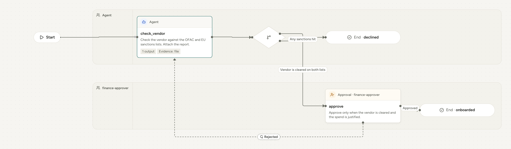

Every `PROCESS.md` is also a map. The steps, their kinds, their routes and their rejections are enough to draw the whole process, so the map is **generated from the file and never maintained beside it**. There is no second source of routing to drift out of date.

```markdown supplier-onboarding/PROCESS.md
---
name: supplier-onboarding
description: Check a new supplier against sanctions lists and get finance approval.
inputs:
  vendorName: string
steps:
  - id: check_vendor
    agent: Check the vendor against the OFAC and EU sanctions lists. Attach the report.
    output: { cleared: boolean }
    evidence: [file]
    next:
      - { to: approve, when: Vendor is cleared on both lists }
      - { to: decline, when: Any sanctions hit }
  - id: approve
    person: finance-approver
    approve: Approve only when the vendor is cleared and the spend is justified.
    on_reject: check_vendor
    next: done
  - id: decline
    finish: declined
  - id: done
    finish: onboarded
---

# Supplier onboarding

The agent screens the vendor, finance approves, and the supplier is onboarded.
```

<a href="../assets/maps/supplier-onboarding-light.png">
<picture>
  <source media="(prefers-color-scheme: dark)" srcset="../assets/maps/supplier-onboarding-dark.png">
  
</picture>
</a>
<p><sub>Select the map to see it full size, or <a href="https://agentprocess.io/docs/authoring/process-maps/">explore it interactively</a>.</sub></p>

## How each part is drawn

These are the conventions of the map on agentprocess.io and in the reference server. They are a recommendation, not a requirement: the map is informative, and a server is free to draw it differently.

| In the file | On the map |
|---|---|
| The first step | A **Start** marker leads into it. |
| Who does a step | A **lane** for each performer: *Agent* for `agent:` steps, then one lane for each role or person named in `task:` and `approve:` steps. Waits and finishes sit in the lane of the step before them. |
| A step | A **card** with its kind, its id and its instructions, and badges for outputs, evidence and checks. |
| `next:` as a list | A **decision point** after the step, with one line per route labelled with its `when` text. |
| `approve:` | An approval card with an **Approved** line forward. `on_reject` adds a dashed **Rejected** line back to that step; without it, the card says the run ends rejected. |
| `parallel:` (profile) | The branches start together and meet at a **join bar** before the process continues. |
| `finish:` | An **End** marker with the outcome. |

Read left to right, the map shows at a glance who does what, where people decide, which way rejections flow, and every way the process can end.

## Where maps appear

- **On agentprocess.io**, every example process in these docs is drawn as an interactive map under its file: select a step to read its instructions, expand it, or switch to a step-by-step list.
- **In a process server**, beside each published version and each run, so people see where the work is.
- **On GitHub**, where a page cannot run the interactive map, the examples show the same map as an image.

## Write steps that map well

- **Keep `when` labels short.** They label the lines. "Vendor is cleared on both lists" reads well; a paragraph does not. Put the detail in the step's instructions.
- **Name finish outcomes after the state reached.** `approved_for_setup` says more on a map than `done`.
- **Give step ids that read as actions.** `check_vendor` becomes *Check vendor*.
- **Let rejections go where the work can be fixed.** A dashed line back to the right step is the clearest signal of how rework flows.
