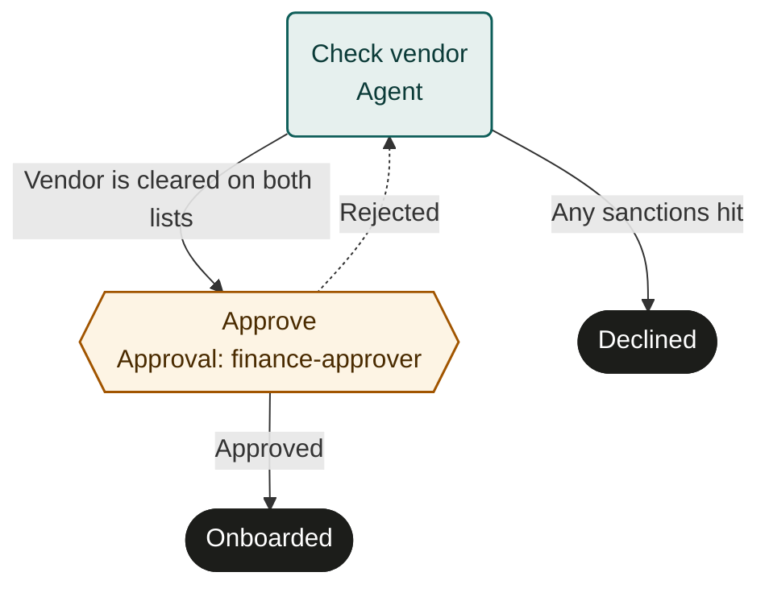

Every `PROCESS.md` is also a map. The steps, their kinds, their routes and their rejections are enough to draw the whole process, so the map is **generated from the file and never maintained beside it**. There is no second source of routing to drift out of date.

```markdown supplier-onboarding/PROCESS.md
---
name: supplier-onboarding
description: Check a new supplier against sanctions lists and get finance approval.
inputs:
  vendorName: string
steps:
  - id: check_vendor
    agent: Check the vendor against the OFAC and EU sanctions lists. Attach the report.
    output: { cleared: boolean }
    evidence: [file]
    next:
      - { to: approve, when: Vendor is cleared on both lists }
      - { to: decline, when: Any sanctions hit }
  - id: approve
    person: finance-approver
    approve: Approve only when the vendor is cleared and the spend is justified.
    on_reject: check_vendor
    next: done
  - id: decline
    finish: declined
  - id: done
    finish: onboarded
---

# Supplier onboarding

The agent screens the vendor, finance approves, and the supplier is onboarded.
```



## How each part is drawn

The conventions below are the ones these docs and the starter process library use. They are a recommendation, not a requirement: the map is informative, and a server is free to draw it differently.

| In the file | On the map |
|---|---|
| `agent:` step | A teal box labelled *Agent*. |
| `task:` step | An amber box labelled with the person or role. |
| `approve:` step | An amber hexagon labelled *Approval* and the role, with an *Approved* line forward and a dashed *Rejected* line. |
| `on_reject:` | The dashed *Rejected* line goes back to that step. Without it, it ends at a *Rejected* outcome. |
| `next:` as a list | One line per route, labelled with its `when` text. |
| `wait`, `wait_until`, `wait_for` | A blue slanted box. `wait_for` with a `timeout` adds a dashed *Timeout* line. |
| `parallel:` (profile) | A fork into every branch and an *All branches complete* join before the process continues. |
| `finish:` | A dark pill with the outcome. |

Colour says who has the ball: **teal for agents, amber for people, blue for waiting**, dark for the end. Read top to bottom, a map shows at a glance where people decide, which way rejections flow, and every way the process can end.

## Where maps appear

- **On GitHub**, as a Mermaid diagram in the file's body. GitHub renders it in place, as above. Put it under a `## Process map` heading at the end of the body, and regenerate it whenever the steps change.
- **On agentprocess.io**, every example process in these docs is drawn as an interactive map under its file: select a step to read its instructions, or switch to a step-by-step list.
- **In a process server**, which can draw the published version beside each run, so people see where the work is.

## Write steps that map well

- **Keep `when` labels short.** They label the lines. "Vendor is cleared on both lists" reads well; a paragraph does not. Put the detail in the step's instructions.
- **Name finish outcomes after the state reached.** `approved_for_setup` says more on a map than `done`.
- **Give step ids that read as actions.** `check_vendor` becomes *Check vendor*.
- **Let rejections go where the work can be fixed.** A dashed line back to the right step is the clearest signal of how rework flows.
