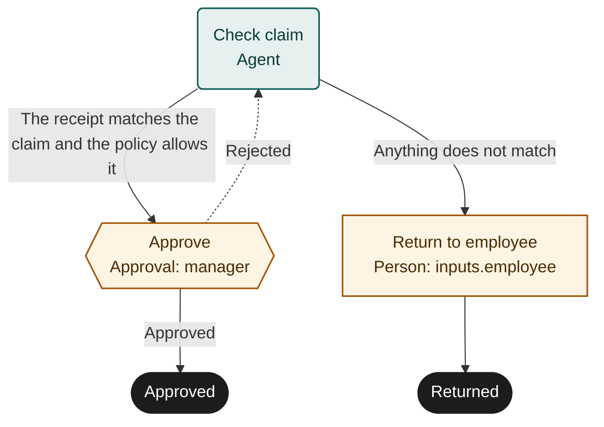

This guide writes an expense approval: an agent checks a claim against its receipt, the employee's manager approves, and a claim that does not match goes back to the employee. It is one file of about 45 lines.

## Write the file

A process lives in a folder with the same name as the process. Create `expense-approval/PROCESS.md`:

```markdown expense-approval/PROCESS.md
---
name: expense-approval
description: Check an expense claim against its receipt and the travel policy, then get the manager's approval.
inputs:
  employee: person
  amount: { type: number, description: Claimed amount in USD }
  receiptUrl: string
requires:
  systems: [expense-tool]
steps:
  - id: check_claim
    agent: |
      Open the receipt at inputs.receiptUrl. Check that its amount, date and
      merchant match the claim, and that the expense is allowed by the travel
      policy. Say in your summary what you checked and what you found.
    output:
      matches: boolean
      category: { type: string, one_of: [travel, meals, equipment, other] }
    evidence: [link]
    next:
      - { to: approve, when: The receipt matches the claim and the policy allows it }
      - { to: return_to_employee, when: Anything does not match }

  - id: approve
    person: manager
    approve: Approve when the receipt matches and the expense is within policy.
    due: 2d
    on_reject: check_claim
    next: approved

  - id: return_to_employee
    task: Tell the employee what does not match and ask for a corrected claim.
    person: inputs.employee
    next: returned

  - id: approved
    finish: approved

  - id: returned
    finish: returned
---

# Expense approval

Start this when an employee submits an expense claim with a receipt. The agent
checks the claim and the employee's manager approves it. Payment is a separate
process in finance. A claim that does not match goes back to the employee to
correct.
```



## What each part does

| Part | Meaning |
|---|---|
| `name`, `description` | What people see in a catalog. The name is lowercase words joined by hyphens and matches the folder. |
| `inputs` | The fields a run starts with. `person` is an identity the server resolves, such as an email. |
| `requires` | The external systems the work needs, here the tool the receipts live in. A server shows the list to anyone adopting the process and never checks or grants the access. |
| `agent:` | A step an agent completes. The text is its instructions. |
| `output` | Fields the submission must contain, with types. `one_of` limits a field to listed values. |
| `evidence: [link]` | The submission must attach at least one link. `[file]` would require an uploaded file. |
| `next` as a list | The actor chooses one route and gives a reason. The `when` text says when to take each one. |
| `approve:` with `person: manager` | A person approves or rejects. `manager` is a role name local to this process. |
| `due: 2d` | After two days the step is marked overdue and people are notified. The work stays open. |
| `on_reject: check_claim` | A rejection sends the run back to the check, with the manager's note. |
| `task:` with `person: inputs.employee` | A person's task, assigned to whoever the run's `employee` input names. |
| `finish:` | Ends the run with an outcome. |

The body is plain language for agents and people. A server shows it with every claim.

## Check it

A server refuses a file that breaks the rules in [§2 of the specification](../spec/specification.md), and reports every issue at once. The ones that catch most first drafts:

- Every step has an `id` and exactly one kind key.
- Every `next`, `on_reject` and `on_timeout` names a step that exists.
- Every step is reachable from the first one, and a non-finish step that is last in the list names its `next`.
- Following `next` never visits a step twice. Only `on_reject` goes back.
- A `person` path names an input or output field declared as `person`.
- Unknown keys are refused anywhere in the frontmatter.

## Publish and run it

On a conforming server:

1. **Import** the folder. The server creates a draft and asks you to map each role name, here `manager`, to a group of people in your organization.
2. **Publish.** The server checks the file and creates version 1 with a content hash. That version never changes.
3. **Start a test run** with `mode: test` and inputs such as `{ "employee": "sam@example.com", "amount": 84.5, "receiptUrl": "https://…" }`. In a test run, agents must cause no real external effects and the server sends no real notifications.

Then watch it move:

- The agent calls `get_work`, sees `check_claim`, and `claim`s it. The claim carries the instructions, this body, the run's inputs and the output it must return.
- The agent opens the receipt, then calls `submit` with `output: { "matches": true, "category": "travel" }`, a link as evidence, a summary, `next: "approve"` and a reason.
- The server checks the output against the declared fields. If anything is missing or mistyped, it refuses with every issue and nothing changes. Otherwise the run moves to `approve`, and a work item appears for the `manager` group.
- A manager calls `decide` with `approved`, and the run ends with outcome `approved`. Had they rejected it with a note, the run would have returned to `check_claim`, and the next agent would read that note first.

## Next steps

- [Best practices](best-practices.md): write steps that agents and people can act on without asking.
- [Specification](../spec/specification.md): every key, type and rule.
